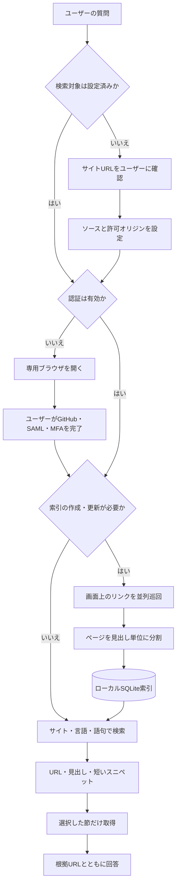

# GitHub Pages Retrieval MCP

認証が必要なPrivate GitHub Pagesを、AIエージェントから検索するためのローカルMCPです。GitHub、SAML、MFAは専用ブラウザでユーザー自身が完了し、取得したページはローカルのSQLite索引から検索します。

> このMCPはローカル実行専用です。Cloud Agentやクラウド上のコードレビューから、ユーザーPCの認証済みブラウザや索引を利用することはできません。

## できること

- 初回にサイトURLを受け取り、検索対象を自動設定
- サイト内リンクをたどり、構成変更に追従して索引を更新
- 複数サイトと複数言語を個別または横断で検索し、必要な節だけ取得
- Cookie、ページ本文、検索索引をユーザーPC内に保持

## インストール

### Claude Code

```sh
/plugin marketplace add ma-nakaya/github-pages-retrieval-mcp
/plugin install github-pages-retrieval@github-pages-retrieval-marketplace
```

### GitHub Copilot CLI

```sh
copilot plugin marketplace add ma-nakaya/github-pages-retrieval-mcp
copilot plugin install github-pages-retrieval@github-pages-retrieval-marketplace
```

リポジトリがPrivateの場合、Copilot CLIが内部で実行するHTTPS cloneにもGitHub認証が必要です。GitHub CLIにはログイン済みでも、Gitのcredential helperが未設定だと`Repository not found`になることがあります。その場合は、次を実行してからマーケットプレイスを追加してください。

```sh
gh auth status
gh auth setup-git
```

`/allow-all`はCopilot CLIによるツール実行の許可であり、Privateリポジトリへのアクセス権やGit認証を付与するものではありません。

初回起動時に、必要なNode.jsパッケージとPlaywright Chromiumを自動で導入します。

## 使い方

1. エージェントにPrivate Pagesの内容を調べるよう依頼します。
2. 検索対象が未設定なら、エージェントがサイトURLを質問します。URLを回答すると、ソースID、許可オリジン、専用ブラウザプロファイルが自動設定されます。
3. 認証が必要な場合はローカルブラウザが開きます。GitHub、SAML、MFAを完了し、エージェントに完了したことを伝えます。
4. 初回またはサイト更新時に索引を作成します。その後はコンポーネント名、API名、設定項目などを通常の言葉で検索できます。

たとえば、次のように依頼できます。

```text
このPrivate Pagesを検索対象にして:
https://example.github.io/private-docs/

日本語版のテーブルコンポーネントで、行選択の設定を調べて
```

## 検索の仕組み



サイトマップには依存せず、画面上のナビゲーションリンクからページ構成を検出します。検索索引はローカルのSQLiteに保存し、サイト更新時だけ差分更新します。

検索結果はURL、見出し、短いスニペットを先に返し、必要な節だけ取得します。ページ全文を毎回モデルへ渡さないため、トークン消費を抑えられます。

複数サイトを登録できます。通常は対象サイトだけを検索し、横断検索を依頼した場合は全サイトからまとめて検索します。認証と索引更新はサイトごとに行います。

## ローカルデータとセキュリティ

設定、ブラウザプロファイル、認証状態、検索索引は非公開のローカルディレクトリへ保存されます。Claude Codeは`CLAUDE_PLUGIN_DATA`、GitHub Copilot CLIは`COPILOT_PLUGIN_DATA`として提供する永続ディレクトリを利用します。手動起動時は`GPR_PLUGIN_DATA`で保存先を上書きできます。

- アクセスするのは設定されたPagesオリジン内のHTMLページだけです。
- ソースリポジトリ、GitHub API、外部の埋め込みサービスは利用しません。
- パスワード、MFAコード、CookieをMCPツールへ入力しません。
- 日常利用のChromeプロファイルは使わず、サイトごとの専用プロファイルを作成します。
- `config.local.json`、ブラウザプロファイル、検索索引をGitへコミットしないでください。

プラグイン更新後も認証状態を維持するには、プラグイン外の永続ディレクトリを指定してください。

## 開発

Node.js 22.5以降を使用します。手動設定の例は`config.example.json`にあります。

```sh
npm install
npm test
npm start
```
